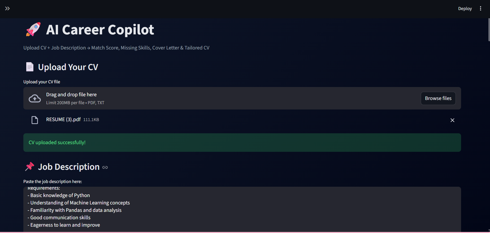
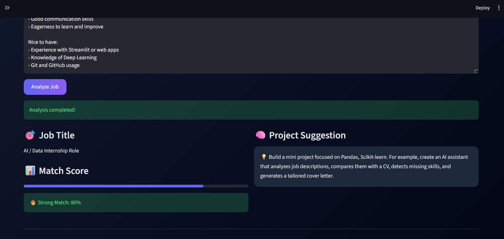
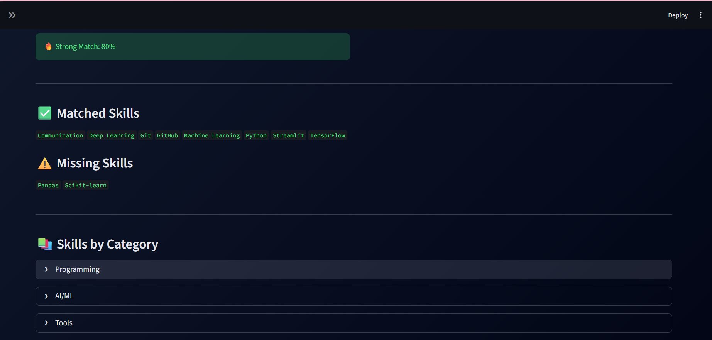
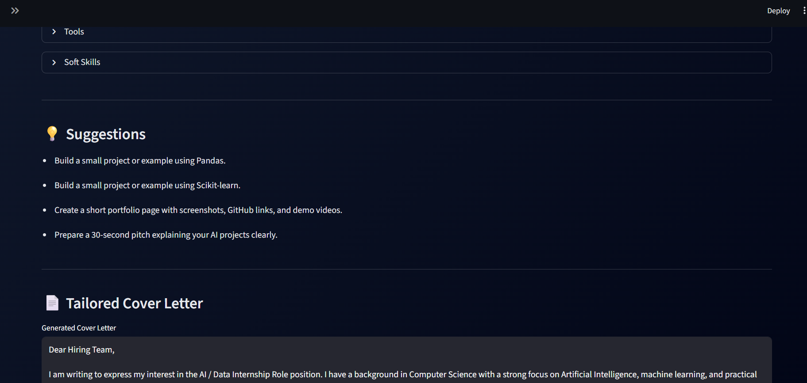
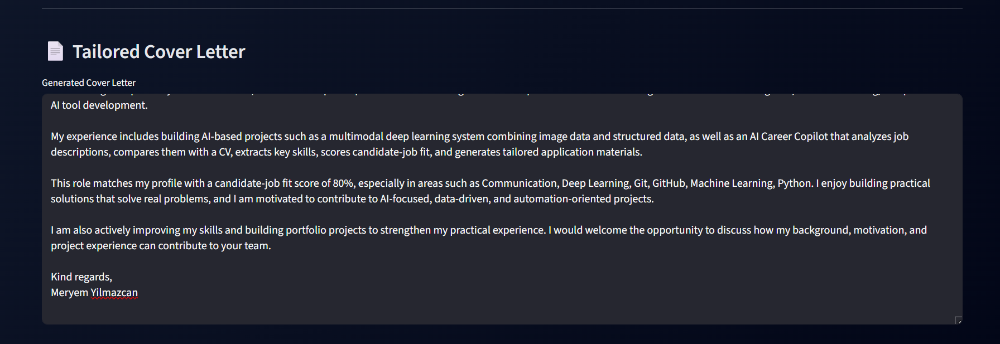

# 🤖 AI Career Copilot

An intelligent tool that analyzes CVs and job descriptions, computes match scores, identifies skill gaps, and generates tailored application materials.

---

## 🚀 Features

- 📄 CV parsing (PDF / Text)
- 🧠 Job description analysis
- 📊 Match score calculation
- 🔍 Missing skills detection
- ✉️ Template-based cover letter generation
- 🧾 CV generation based on job requirements
- ⚙️ Rule-based scoring system
- 📦 Structured JSON output
- 📥 Export analysis as CSV

---

## 📸 Demo

### 🔹 CV Upload & Job Description


### 🔹 Match Score & Skills


### 🔹 Suggestions & Cover Letter


### 🔹 Generated CV


### 🔹 Structured Output


---

## 🧠 How It Works

1. Upload your CV  
2. Paste a job description  
3. Extract skills from both inputs  
4. Compare and compute match score  
5. Detect missing skills  
6. Generate personalized cover letter and CV  

---

## 🛠 Tech Stack

- Python  
- Streamlit  
- Pandas  
- PyPDF2  
- Rule-based NLP techniques  

---

## ▶️ Run Locally

```bash
pip install -r requirements.txt
streamlit run app.py 
